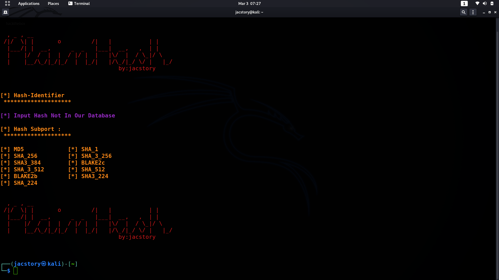

# PlainHash
* PlainHash written by python 3.9.1

##info 
* plainHash tools hepe crack hash by using wordlist
* Plain_Hash use Secure hashes and message digests 'hashlib'
##  Hash Subport : 
* MD5  - SHA_1 - SHA_256
* SHA3_384 - BLAKE2c - SHA_3_512
* SHA_512  - BLAKE2b - BLAKE2b 
* SHA3_224 - SHA3_224  - SHA_3_256
##How to use :
* git clone https://github.com/jac11/PlainHash
* cd PlainHash/
* chmod +x PlainHash.py.py
* to check all  option open help menu by typing ./PlainHash.py -h or --help
* 
##  [ help menu overview ]
 

### ScreenShot
    
  
### [for Connect]
* administrator@jacstory.tech
* thank you 
