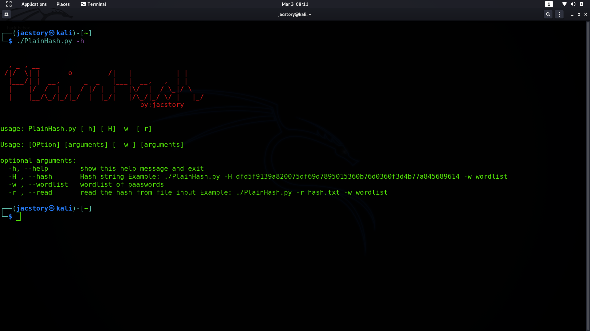
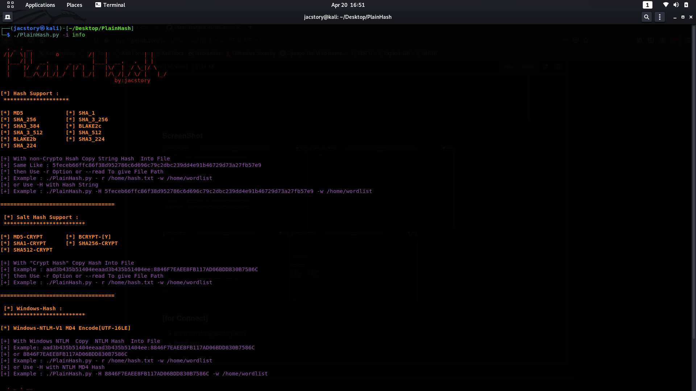
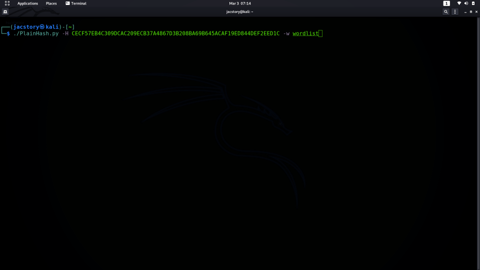
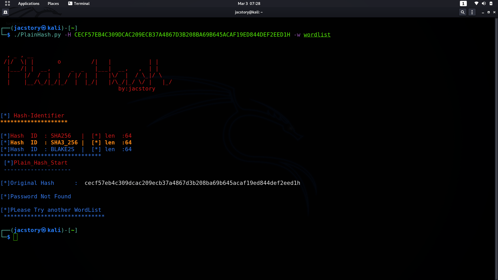
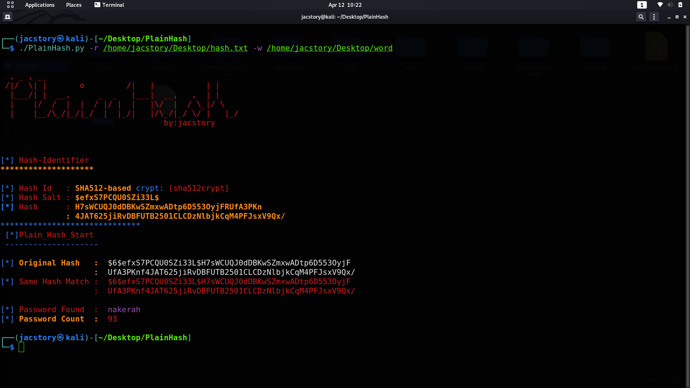

# PlainHash
* PlainHash written by python 3.9.1

## info 
* plainHash script help to  crack hash by using wordlist
* PlainHash use Secure hashes and message digests 'hashlib'
* PlainHash use for salt hash 'crypt' 
* user -i info or --info info for more information
##  Hash Support : 
* MD5  - SHA_1 - SHA_256
* SHA3_384 - BLAKE2c - SHA_3_512
* SHA_512  - BLAKE2b - BLAKE2b 
* SHA3_224 - SHA3_224  - SHA_3_256
### Salt Hash Support:
* MD5-CRYPT  - BCRYPT-[Y]
* SHA1-CRYPT - SHA256-CRYPT
* SHA512-CRYPT
### Windows-Hash
* Windows-NTLM-V1 MD4 Encode[UTF-16LE]
## How to use :
* git clone https://github.com/jac11/PlainHash
* cd PlainHash/
* chmod +x PlainHash.py
* to check all  option open help menu by typing ./PlainHash.py -h or --help
* you can use input hash Example: ./PlainHash.py -H dfd5f9139a820075df69d7895015360b76d0360f3d4b77a845689614 -w wordlist
* or you can use as file input ./PlainHash.py -r hash.txt -w wordlist
##  [ help menu overview ] 
 

### ScreenShot
     
  
### [for Connect]
* administrator@jacstory.tech
* thank you 
